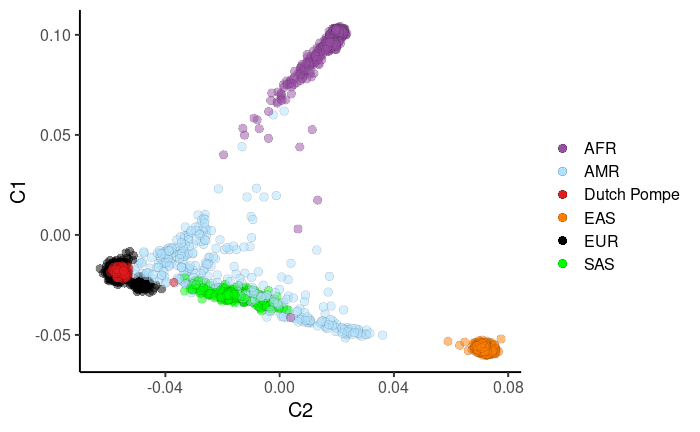
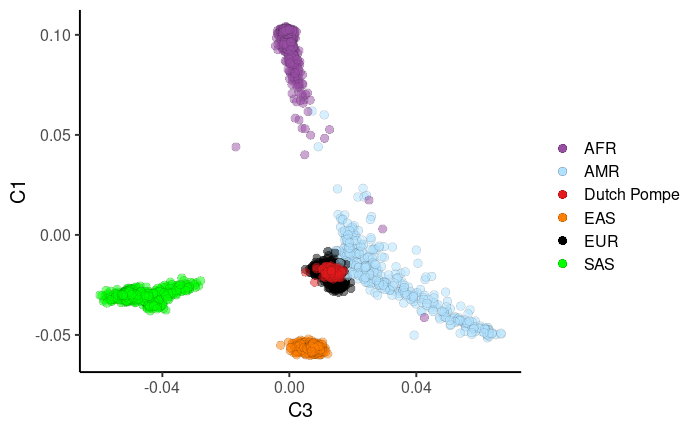
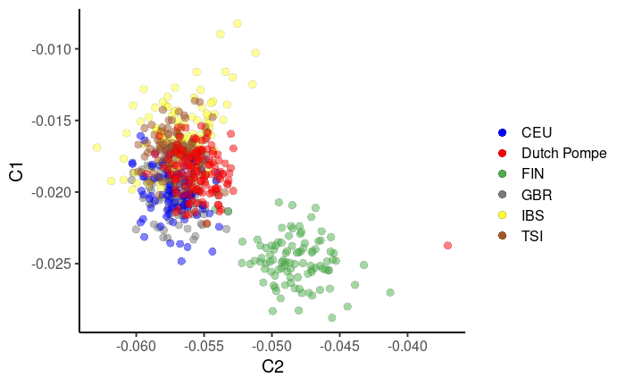
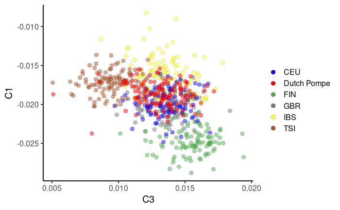
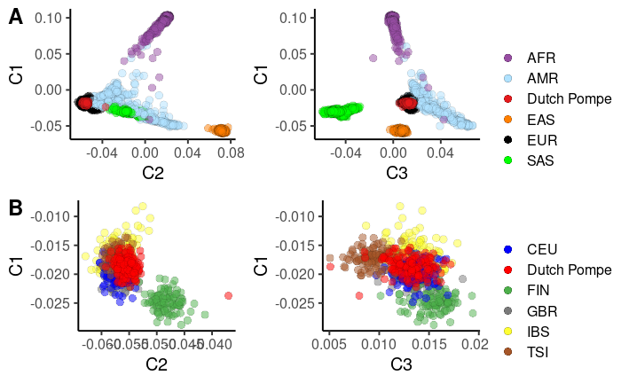

vcf data

# 03/08/2021
**used**
**- bcftools 1.10.2**
Using htslib 1.10.2-3
Copyright (C) 2019 Genome Research Ltd.
License Expat: The MIT/Expat license

**- PLINK v1.90b6.21 64-bit (19 Oct 2020)**
[www.cog-genomics.org/plink/1.9/](www.cog-genomics.org/plink/1.9/)
(C) 2005-2020 Shaun Purcell, Christopher Chang
GNU General Public License v3

**- R version 4.1.0**
**- RStudio 1.4.1717**

# vcf data
**VCF files recieved from Douglas:**
chr*.dose.vcf.gz
chr*.dose.vcf.gz.tbi
chr*.info
**working dir**: ~/Documents/Douglas/POMPE_MDS_analysis
* * *
**1. Convert the vcf files to BCF and fix header**
- Fix header (1st pipe)

```
#Get header from any of the vcfs
bcftools view -h ../POMPE_vcf/chr14.dose.vcf.gz > hdr.txt

``` 

```
#Open hdr.txt file using any editor and add the folowing lines after the last ##INFO line
##FILTER=<ID=GENOTYPED,Description="Site was genotyped">
##FILTER=<ID=GENOTYPED_ONLY,Description="Site was genotyped only">
```

- Ensure that multi-allelic calls are split and that indels are left-aligned compared to reference genome (2nd pipe)
- Sets the ID field to a unique value: CHROM:POS:REF:ALT (3rd pipe)
- Removes duplicates (4th pipe)

```
#create output dir
mkdir -p 01.POMPE_bcf

#Define variables
export fasta=~/Documents/References/Human/Hg19/1000G/human_g1k_v37.fasta 
export vcf_dir=../POMPE_vcf
export bcf_dir=01.POMPE_bcf

for chr in {1..22}; do
    echo ${chr} ;
    sed -i "s/contig=<ID=[0-9]*>/contig=<ID=${chr}>/" hdr.txt ;
        
    bcftools reheader -h hdr.txt  ${vcf_dir}/"chr"$chr.dose.vcf.gz | \
    bcftools norm -m-any --check-ref w -f ~/Documents/References/Human/Hg19/1000G/human_g1k_v37.fasta |\
    bcftools annotate -x ID -I +'%CHROM:%POS:%REF:%ALT' | \
	bcftools norm -Ob --rm-dup both  > ${bcf_dir}/"chr"$chr.dose.bcf ;

    bcftools index ${bcf_dir}/"chr"$chr.dose.bcf ;
done
```
* * *
**2. Convert the BCF files to PLINK format, update metadata and filter ou undisered individuals**
- First step will input the bcf files from last command and create plink format output
- Second will update patient IDs based on Douglas information (I couldn't figure out how to do  it from beggining)
Create update id file using the following command
```
awk '{print "0", $1, $1, $1}' ../POMPE.post.zCall.Plink/POMPE.post.zCall.fam > Update_id.txt
```

0 |121Adult| 121Adult| 121Adult
|:----:|:---------:|-|-|
0| 12Young| 12Young| 12Young
0| 6Young| 6Young| 6Young

- Third will update the sex
Create update id file using the following command
```
awk '{print $1, $1, $5}' ../POMPE.post.zCall.Plink/POMPE.post.zCall.fam  > Update_sex.txt
```

|121Adult| 121Adult| 1
|:----:|:---------:|-|
|12Young| 12Youn| 2
|6Young| 6Young| 1

- Finnaly keep only 130 the used parients (Used_patients.txt)

|100Adult| 100Adult|
|:----:|:---:|
|103Adult| 103Adult|
|104Adult| 104Adult|


```
mkdir -p 02.POMPE_plink

#Define variables
export bcf_dir=01.POMPE_bcf
export plink_dir=02.POMPE_plink
export original_fam=~/Documents/Douglas/POMPE.post.zCall.Plink/POMPE.post.zCall.fam

for chr in {1..22}; do
#Convert the BCF files to PLINK format
    plink --noweb \
      --bcf ${bcf_dir}/"chr"$chr.dose.bcf \
      --fam ${original_fam}  \
      --keep-allele-order \
      --vcf-idspace-to _ \
      --const-fid \
      --allow-extra-chr 0 \
      --split-x b37 no-fail \
      --make-bed \
      --out ${plink_dir}/"chr"$chr.dose.bcf ;
   
#Update patien ID  
   plink --noweb \
      --bfile ${plink_dir}/"chr"$chr.dose.bcf \
      --update-ids Update_id.txt \
      --make-bed \
      --out ${plink_dir}/"chr"$chr.dose.id 

#update patient sex
   plink --noweb \
      --bfile ${plink_dir}/"chr"$chr.dose.id \
      --update-sex Update_sex.txt \
      --make-bed \
      --out ${plink_dir}/"chr"$chr.dose.sex

#Keep used patients      
    plink --noweb \
      --bfile ${plink_dir}/"chr"$chr.dose.sex  \
      --keep Used_patients.txt \
      --chr 1-22 \
      --make-bed \
      --out ${plink_dir}/"chr"$chr.dose.genotypes
      
   rm ${plink_dir}/"chr"$chr.dose.bcf*
   rm ${plink_dir}/"chr"$chr.dose.id*
   rm ${plink_dir}/"chr"$chr.dose.sex*

done

```
* * *
**3. Prune variants from each chromosome**
```
--maf 0.10, only retain SNPs with MAF greater than 10%
--indep [window size] [step size/variant count)] [Variance inflation factor (VIF) threshold]
```
*e.g.* indep 50 5 1.5, Generates a list of markers in approx. linkage equilibrium - takes 50 SNPs at a time and then shifts by 5 for the window. VIF (1/(1-r^2)) is the cut-off for linkage disequilibrium

```
mkdir -p 03.POMPE_pruned ;

#Define variables
export plink_dir=02.POMPE_plink
export pruned_dir=03.POMPE_pruned


for chr in {1..22}; do

   plink --noweb \
      --bfile ${plink_dir}/"chr"$chr.dose.genotypes \
      --maf 0.10 --indep 50 5 1.5 \
      --out ${pruned_dir}/"chr"$chr.dose.genotypes ;
 
    plink --noweb \
      --bfile ${plink_dir}/"chr"$chr.dose.genotypes \
      --extract ${pruned_dir}/"chr"$chr.dose.genotypes.prune.in \
      --make-bed \
      --out ${pruned_dir}/"chr"$chr.dose.genotypes.pruned ;

    rm ${pruned_dir}/"chr"$chr.dose.genotypes.prune.*
    rm ${pruned_dir}/"chr"$chr.dose.genotypes.log
     
done 
```


* * *
**4. Merge all POMPE plink processed files**

```
#Get a list of all PLINK files to merge
mkdir -p 04.POMPE_processed
find . -name "*.bim" | grep -e "pruned" > ForMerge.list ;
sed -i 's/.bim//g' ForMerge.list ;

#Merge all projects into a single PLINK file
plink --noweb \
	--merge-list ForMerge.list \
	--out 04.POMPE_processed/POMPE_Merge ;

```

* * *
**5a. Filter SNPs out from your dataset which do not meet Quality Control criteria**
```
(Minor Allele Frequency < 0.01; Genotype Call Rate < 95%; Hardy-Weinberg Equilibrium < 1x10^6) 
```
```
export merge_dir=04.POMPE_processed
export merged_file=POMPE_Merge

plink --noweb \
	--bfile ${merge_dir}/${merged_file} \
    --hwe 1e-6 --geno 0.05 --maf 0.01 \
    --make-bed \
    --out ${merge_dir}/${merged_file}_filtered

```

**5b. Check for duplicated SNPs typing:**
- If you had any problem on the command above you probably have duplicated SNPs Ids, positions etc

You can check by doing as follows:
```
export merge_dir=04.POMPE_processed
export merged_file=POMPE_Merge
cat ${merge_dir}/${merged_file}.bim | cut -f2 | uniq -d |head
```
- If you **do have** duplicated SNPs you will have to filter them out. You can do it as follows:
```
export merge_dir=04.POMPE_processed
export merged_file=POMPE_Merge

#create list of duplicated rsID
cat ${merge_dir}/${merged_file}.bim | cut -f2 | uniq -d > reference.dups 

#filter out
plink --noweb \
	--bfile ${merge_dir}/${merged_file} \
    --exclude reference.dups \
    --hwe 1e-6 --geno 0.05 --maf 0.01 \
    --make-bed \
    --out ${merge_dir}/${merged_file}_filtered

```
***
**6. Prepare the 1000G and the POMPE genotype data**

**NB -** 1000 genome data was pre-processed as described in [https://www.biostars.org/p/335605/](https://www.biostars.org/p/335605/)

#Prepare the 1000G and the POMPE genotype data by extracting only snps that are in common between the two genotype data sets - this avoids exhausting the system memory. We are also removing the strand ambiguous snps from the genotyped data set to avoid strand mismatch among these snps. Your genotype files should be filtered to remove markers which do not satisfy the quality control criteria above. (as described [here](https://enigma.ini.usc.edu/wp-content/uploads/2012/07/ENIGMA2_1KGP_cookbook_v3.pdf))

```
export merge_dir=04.POMPE_processed
export merged_file=POMPE_Merge
export datafile=${merged_file}_filtered

awk '{print $2}' ~/Documents/References/Human/Hg19/1000G/Merge.bim  > ${merge_dir}/1kG.snplist.txt

plink --noweb \
	--bfile ${merge_dir}/$datafile \
	--extract ${merge_dir}/1kG.snplist.txt \
	--make-bed  \
	--out ${merge_dir}/local
	
awk '{ if (($5=="T" && $6=="A")||($5=="A" && $6=="T")||($5=="C" && $6=="G")||($5=="G" && $6=="C")) print $2, "ambig" ; else print $2 ;}' ${merge_dir}/$datafile.bim | grep -v ambig > ${merge_dir}/local.snplist.txt

plink --noweb \
	--bfile ~/Documents/References/Human/Hg19/1000G/Merge \
	--extract ${merge_dir}/local.snplist.txt \
	--make-bed \
    --out ${merge_dir}/external
```

***
**7. Merge the two sets of plink files**
#In merging the two files plink will check for strand differences. If any strand differences are found plink will crash with the following error (ERROR: Stopping due to mismatching SNPs check +/- strand?)
##Ignore warnings regarding different physical positions (SIC, as described [here](https://enigma.ini.usc.edu/wp-content/uploads/2012/07/ENIGMA2_1KGP_cookbook_v3.pdf))

```
export merge_dir=04.POMPE_processed
export merged_file=POMPE_Merge
export datafile=${merged_file}_filtered

plink --noweb \
	--bfile ${merge_dir}/local \
	--bmerge ${merge_dir}/external.bed ${merge_dir}/external.bim ${merge_dir}/external.fam \
	--make-bed  \
	--out ${merge_dir}/1kG_POMPE
```
***
**8. Run the MDS analysis**
```
plink --noweb \
	--bfile ${merge_dir}/1kG_POMPE \
	--cluster --mind .05 --mds-plot 10 \
	--extract ${merge_dir}/local.snplist.txt  \
	--out ${merge_dir}/1kG_POMPE_mds
```
***
**9. Formating**

- Plot the MDS results using R 
```
awk 'BEGIN{OFS=","};{print $1, $2, $3, $4, $5, $6, $7}' >> ${merge_dir}/1kG_POMPE_R.mds.csv ${merge_dir}/1kG_POMPE_mds.mds
```
#This formats the plink output into an R compatible format.
***
**10. Optional: Run the PCA analysis**

```
export merge_dir=04.POMPE_processed
plink --noweb \
	--bfile ${merge_dir}/1kG_POMPE \
	--pca
```
***
# Generate plots in R
RStudio 1.4.1717 (2021-05-24)  -- "Juliet Rose" 
R version 4.1.0 (2021-05-18) -- "Camp Pontanezen"
Copyright (C) 2021 The R Foundation for Statistical Computing
Platform: x86_64-pc-linux-gnu (64-bit)
Running under: Ubuntu 20.04.2 LTS
03/08/2021 
***
title: "POMPE MDS plot"
author: "JCMM"
***

## Install and load packages
[Elegant-way-to-check-for-missing-packages-and-install-them](https://stackoverflow.com/questions/4090169/elegant-way-to-check-for-missing-packages-and-install-them)

```{r, install and load packages}
list_of_packages <- c("dplyr", "grafify", "RColorBrewer", "ggpubr")

install.packages.auto <- function(x) { 
  if(isTRUE(x %in% .packages(all.available = TRUE))) { 
    eval(parse(text = sprintf("require(\"%s\")", x)))
  } else { 
    #update.packages(ask= FALSE) #update installed packages.
    eval(parse(text = sprintf("install.packages(\"%s\", dependencies = TRUE)", x)))
  }
  if(isTRUE(x %in% .packages(all.available=TRUE))) { 
    eval(parse(text = sprintf("require(\"%s\")", x)))
  } else {
    if (!requireNamespace("BiocManager", quietly = TRUE))
      install.packages("BiocManager")
    eval(parse(text = sprintf("BiocManager::install(\"%s\")", x, update = FALSE)))
    eval(parse(text = sprintf("require(\"%s\")", x)))
  }
}

lapply(list_of_packages, function(x) {message(x); install.packages.auto(x)})

rm(list_of_packages, install.packages.auto)

```

```{r }
# Change global default setting so every data frame created will not auto-convert to factors unless explicitly instructed
options(stringsAsFactors = FALSE)
```
***
## Load Files
- 1000 G ped file
```{r, load 1000 G metadata}
PED <- read.table('../Files/20130606_g1k.ped', 
                  header = TRUE, skip = 0, sep = '\t')
#reduce
PED = PED %>% select(Individual.ID, Population)
PED = rename(PED, IID = Individual.ID)
```

- Population code
from: [ftp://ftp.1000genomes.ebi.ac.uk/vol1/ftp/phase3/20131219.populations.tsv](ftp://ftp.1000genomes.ebi.ac.uk/vol1/ftp/phase3/20131219.populations.tsv)
```{r, Load Population code}
POP <- read.table('../Files/20131219.populations.tsv', 
                 header = TRUE,  sep = '\t')

# reduce
POP = POP %>% select(Population.Code, Super.Population)
POP = rename(POP, Population = Population.Code)

#Annotate PED with groups from POP
PED_ann = merge(POP, PED, by = "Population")
```

- mds cluster result
```{r, load mds cluster result}

mds.cluster <- read.csv("../Files/1kG_POMPE_R.mds.csv", 
                       header=T)
G1000.cluster = merge(mds.cluster, PED_ann, by = "IID")

POMPE.cluster = mds.cluster[mds.cluster$FID!=0,]
#check number of POMPE patients, should be 130
dim(POMPE.cluster)

POMPE.cluster$Population= "Dutch Pompe"
POMPE.cluster$Super.Population= "Dutch Pompe"
POMPE.cluster = POMPE.cluster %>%  select(names(G1000.cluster))
#put them back together 
mds_df = rbind( G1000.cluster, POMPE.cluster)

```
***
## Plot mds result
- Axis C1 and C2 for all groups
```{r, plot}
#create a color pallette
super_pop_pal = c(
  "#984EA3",       #AFR
  "lightskyblue1", #AMR
  "#E41A1C",       #POMPE
  "#FF7F00",       #EAS
  "black",         #EUR
  "green"          #SAS
  ) 
  
Fig.a1 <- plot_xy_CatGroup(mds_df,
                          C2,
                          C1,
                          Super.Population,
                          symsize = 3,
                          symthick = 0.1,
                          fontsize = 15,
                          s_alpha = 0.5) +
  scale_fill_manual(values = super_pop_pal, name = "") +
  guides(fill = guide_legend(override.aes = list(alpha = 1)))  # override.aes overwrites the alpha

Fig.a1
```



- Axis C1 and C3 for all groups
```{r, plot}
  
Fig.a2 <- plot_xy_CatGroup(mds_df,
                          C3,
                          C1,
                          Super.Population,
                          symsize = 3,
                          symthick = 0.1,
                          fontsize = 15,
                          s_alpha = 0.5) +
  scale_fill_manual(values = super_pop_pal, name = "") +
  guides(fill = guide_legend(override.aes = list(alpha = 1)))  # override.aes overwrites the alpha

Fig.a2
```        


- Arrange panels A
```{r}

Fig.a <- ggarrange( Fig.a1 ,Fig.a2,
          common.legend = TRUE, legend = "right",
          labels = "A",  font.label = list(size = 18),
          ncol = 2, nrow = 1)
```

***
## Zoom in the European group
- Axis C1 and C2

```{r}
#create a color pallette
EUR_pal = c(
  "blue",    #CEU
  "red" ,    #POMPE
  "#4DAF4A", #FIN*
  "gray48",  #GBR*
  "#FFFF33", #IBS*
  "#A65628"  #TSI*
  ) 

#remove non-EUR
EUR = POP %>% filter(Super.Population == "EUR") 
#plot
Fig.b1 <- plot_xy_CatGroup(mds_df %>% 
                            filter(Population == "Dutch Pompe" | Population %in% EUR$Population),
                          C2,
                          C1,
                          Population,
                          symsize = 3,
                          symthick = 0.1,
                          fontsize = 15,
                          s_alpha = 0.5) +
  # ylim(-0.04,0) +
  # xlim(-0.06,-0.035) +
  scale_fill_manual(values = EUR_pal, name = "") +
  guides(fill = guide_legend(override.aes = list(alpha = 1)))  # override.aes overwrites the alpha

Fig.b1
```


- Axis C1 and C3
```{r}
Fig.b2 <- plot_xy_CatGroup(mds_df %>% 
                            filter(Population == "Dutch Pompe" | Population %in% EUR$Population),
                          C3,
                          C1,
                          Population,
                          symsize = 3,
                          symthick = 0.1,
                          fontsize = 15,
                          s_alpha = 0.5) +
  # ylim(-0.04,0) +
  # xlim(-0.06,-0.035) +
  scale_fill_manual(values = EUR_pal, name = "") +
                    # 
  guides(fill = guide_legend(override.aes = list(alpha = 1)))  # override.aes overwrites the alpha

Fig.b2
```


- Arrange panels B
```{r}

Fig.b <- ggarrange( Fig.b1 ,Fig.b2,
          common.legend = TRUE, legend = "right",
          labels = "B",  font.label = list(size = 18),
          ncol = 2, nrow = 1)
```

- Arrange panels A and B
```{r}

Fig <- ggarrange( Fig.a ,Fig.b,
          ncol = 1, nrow = 2)
Fig
```


- If everyfing looks fine save figures as pdf
```{r}

ggsave("../Plots/POMPE_MDS_plot.AB.pdf", plot = Fig, dpi = 300,
       width = 30,  height = 20,
       units = "cm"
       )
ggsave("../Plots/POMPE_MDS_plot.A.pdf", plot = Fig.a, dpi = 300,
       width = 30,  height = 10,
       units = "cm"
       )
ggsave("../Plots/POMPE_MDS_plot.B.pdf", plot = Fig.b, dpi = 300,
       width = 30,  height = 10,
       units = "cm"
       )
```

## R basic session info:
- attached base packages:
-- stats
--graphics 
--grDevices
--utils
--datasets 
--methods
--base     

- other attached packages:
-- ggpubr_0.4.0
-- RColorBrewer_1.1-2
-- grafify_1.4.1
-- lmerTest_3.1-3
-- lme4_1.1-27.1
--Matrix_1.3-4
--emmeans_1.6.2-1
--ggplot2_3.3.5
--dplyr_1.0.7   
